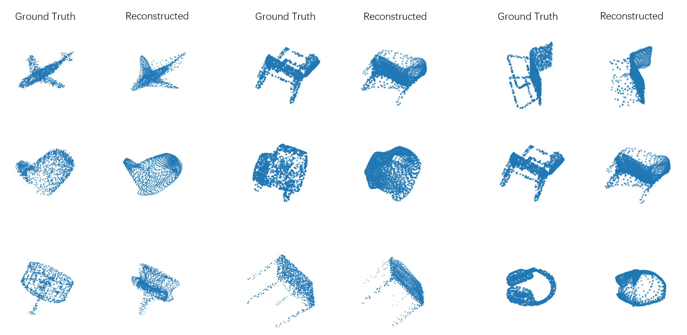

# FoldingNet: Point Cloud Auto-encoder via Deep Grid Deformation

This is an implementation for FoldingNet in PyTorch. FoldingNet is a autoencoder for point cloud. As for the details of the paper, please reference on [arXiv](https://arxiv.org/abs/1712.07262).

## Environment

* Ubuntu 18.04 LTS
* Python 3.8
* CUDA 10.1
* PyTorch 1.7.1

## Reconstruction

In order to train the model to do the reconstruction, use the command:

```bash
python train_ae.py --batch_size <batch_size> --epochs <epochs> --lr <lr> --weight_decay <weight_decay> --num_workers <num_workers>
```

In order to evaluate the model, see the `evaluation_ae.py`

## Examples


